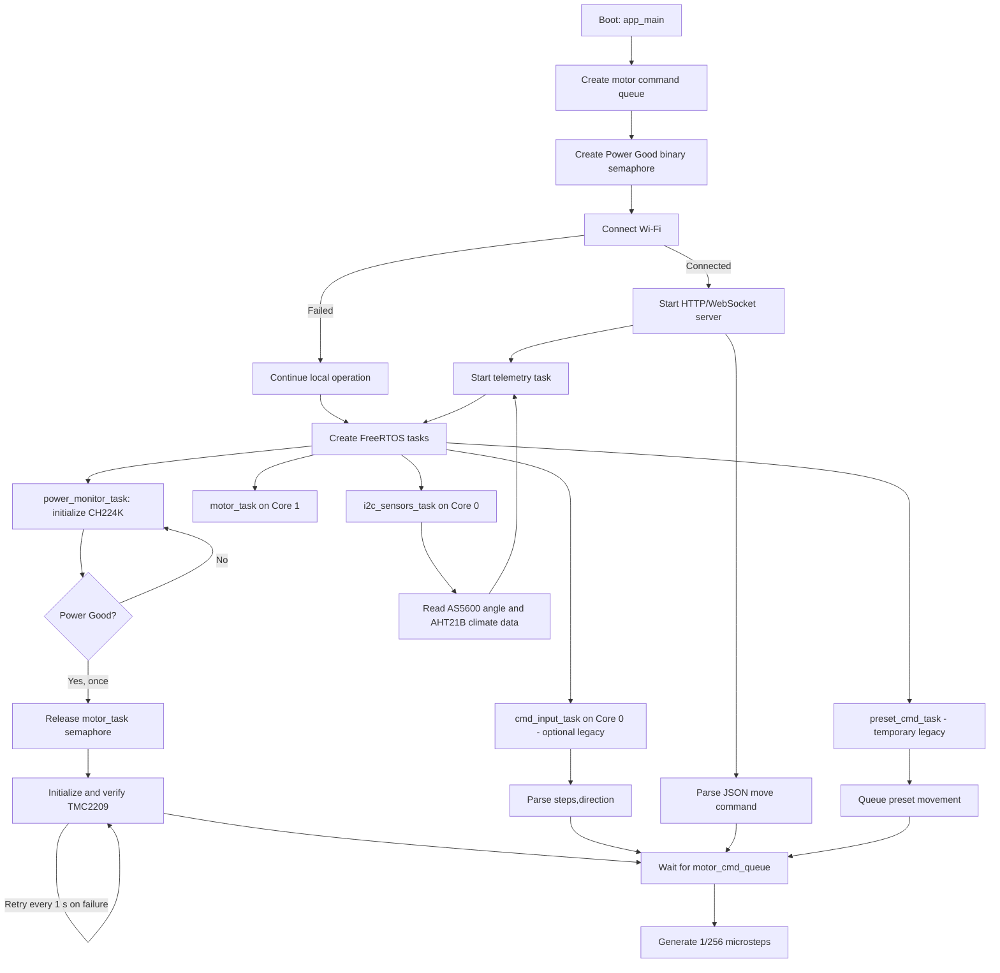

# MODULAR PCB Alpaca
> ESP32-S3 firmware for stepper motor control, magnetic angle sensing, environmental monitoring, ASCOM Alpaca control, and WebSocket telemetry/control.


## Overview

MODULAR PCB Alpaca is an ESP32-S3 firmware for controlling a TMC2209 stepper driver while observing motor angle, temperature, humidity, and power-delivery status. The application is organized as independent ESP-IDF components coordinated by `main.c`, with FreeRTOS tasks and a command queue separating command sources from time-sensitive step generation. ASCOM Alpaca provides the standard focuser HTTP API, while WebSocket remains available for low-level relative moves, acknowledgements, and periodic telemetry. A Python client supplies a reference WebSocket interface.

## Features / Highlights

- **Dedicated motor-control task on Core 1** — The TMC2209 step-generation path is isolated from Wi-Fi and sensor work on Core 0, reducing timing interference during GPIO-based step generation.
- **Power-qualified driver startup** — The motor task blocks on a binary semaphore until the CH224K reports Power Good, preventing the driver from being energized before the power rail is verified.
- **Queue-based command contract** — USB console commands, preset commands, and WebSocket messages are converted into the same `motor_cmd_t` queue entry, so new command transports can be added without changing motor execution.
- **Modular sensor drivers** — AS5600 and AHT21B drivers expose independent APIs and share an orchestrated I2C bus without depending on the TMC2209 or on each other.
- **Fault-tolerant sensor initialization** — Sensor detection uses real device transactions with bounded retries; an unavailable sensor remains disabled while the rest of the firmware continues running.
- **Remote telemetry and acknowledgements** — The embedded HTTP/WebSocket server broadcasts command acknowledgements and JSON telemetry without making the transport layer aware of motor or sensor semantics.
- **ASCOM Alpaca Focuser API** — Management, focuser GET endpoints, absolute `Move`, and `Halt` are served on TCP port `11111`.

## Documentación de Arquitectura

Lea los archivos `.md` en cada carpeta de componentes para detalles de:

- **[ARCHITECTURE.md](ARCHITECTURE.md)** ⭐ — Guía completa de arquitectura, tareas, sincronización, flujos (COMIENZA AQUÍ)
- [**main.md**](main/main.md) — Orquestación de tasks, flujo de arranque, constantes de configuración
- [**alpaca.md**](components/alpaca/alpaca.md) — API ASCOM Alpaca, endpoints, respuestas y control del focuser
- [**tmc2209.md**](components/tmc2209/tmc2209.md) — Protocolo UART Trinamic, CRC8, generación de micropasos
- [**as5600.md**](components/as5600/as5600.md) — Encoder magnético, ángulo de 12 bits, bus I2C compartido
- [**aht21b.md**](components/aht21b/aht21b.md) — Sensor de temperatura/humedad, calibración, I2C
- [**ch224k.md**](components/ch224k/ch224k.md) — Controlador USB-C PD, selección de voltaje, Power Good
- [**focuser_handler.md**](components/focuser_handler/focuser_handler.md) — State machine, mutex-protected, traducción de comandos
- [**wifi_init.md**](components/wifi_init/wifi_init.md) — Conexión WiFi, reintentos, event groups
- [**ws_server.md**](components/ws_server/ws_server.md) — Servidor HTTP/WebSocket, broadcast asincrónico, clients concurrentes

## Execution Flow



## Technical Specifications

### Firmware and runtime

| Parameter | Value | Detail |
|---|---|---|
| MCU target | ESP32-S3 | Dual-core Xtensa target selected in `sdkconfig` |
| CPU configuration | 160 MHz | `CONFIG_ESP32S3_DEFAULT_CPU_FREQ_MHZ=160` |
| Framework | ESP-IDF | Project uses the ESP-IDF CMake project flow |
| Scheduler | FreeRTOS | Tasks are pinned to Core 0 or Core 1 as required |
| Console | USB Serial/JTAG | Commands use `steps,direction`, for example `2000,1` |
| Motor resolution | 1/256 microstepping | Fixed by `TMC_MRES=0` and `MICROSTEPS=256` |
| Full steps per revolution | 200 | One revolution equals 51,200 microsteps |
| Maximum relative command | 204,800 microsteps | `200 * 256 * 4` per command |
| Motor speed profile | 0.05 to 0.30 rev/s | Start and cruise values configured in `main.c` |
| Command queue length | 4 entries | Queue element type is `motor_cmd_t` |

### Hardware pinout

| Subsystem | Signal | GPIO / Interface | Detail |
|---|---|---|---|
| TMC2209 | UART RX / TX | GPIO18 / GPIO17 | UART1, PDN_UART, driver address `0` |
| TMC2209 | STEP | GPIO5 | Direct GPIO step generation |
| TMC2209 | DIR | GPIO6 | Direction input |
| TMC2209 | EN | GPIO21 | Active low |
| TMC2209 | MS1 / MS2 | GPIO1 / GPIO2 | Hardware pins; microstep resolution is configured through `CHOPCONF.MRES` |
| AS5600 + AHT21B | SDA / SCL | GPIO8 / GPIO9 | Shared physical I2C bus, `I2C_NUM_0` |
| AS5600 | I2C address | `0x36` | Magnetic angle sensor |
| AHT21B | I2C address | `0x38` | Temperature and humidity sensor |
| CH224K | CFG1 / CFG2 / CFG3 | GPIO38 / GPIO48 / GPIO47 | Power-delivery configuration pins |
| CH224K | Power Good | GPIO15 | Binary power qualification input |
| CH224K | Voltage sense | GPIO3 / ADC1 channel 3 | ADC-based bus-voltage measurement |
| Status LED | WebSocket client | GPIO10 | ON while at least one WebSocket client is connected |
| Status LED | Motor task | GPIO12 | ON while `motor_task` is alive, including its Power Good and command waits |
| Network console | USB Serial/JTAG | Native ESP32-S3 USB | No external USB-UART interface is configured |

### Communication and timing

| Parameter | Value | Detail |
|---|---|---|
| TMC2209 control | UART1 + STEP/DIR GPIO | UART is used for driver configuration/status; motion uses GPIO steps |
| AS5600 I2C frequency | 400 kHz | Shared bus device configuration |
| AHT21B I2C frequency | 100 kHz | Shared bus device configuration |
| Sensor polling period | 200 ms | AS5600 and AHT21B loop period |
| Power monitoring period | 500 ms | CH224K voltage and PG reads |
| Wi-Fi mode | Station | SSID and password are configured in `main.c` |
| WebSocket endpoint | `ws://<ESP32-IP>:80/ws` | Maximum 4 clients |
| Command payload | `{"cmd":"move","steps":51200,"dir":0}` | `dir` must be `0` or `1` |
| Telemetry period | 5 s | Broadcast only when at least one client is connected |
| Telemetry fields | `power_good`, `encoder_angle`, `climate_temperature` | JSON broadcast from the firmware |
| WebSocket acknowledgement | `{"ack":"queued","steps":N,"dir":D}` | Sent after queue insertion |
| Alpaca endpoint | `http://<ESP32-IP>:11111/api/v1/focuser/0` | GET state, PUT `/move` and `/halt` |
| CH224K voltage preset | 20 V | Selected through `CH224K_VOLTAGE_20V` |
| ADC divider | R1 = 20.0 kOhm, R2 = 2.7 kOhm | Used by the CH224K voltage-sense configuration |

## Repository Structure

```text
MODULAR-PCB-FOCUSHANDLER/
├── CMakeLists.txt                 # Root ESP-IDF project definition
├── sdkconfig                      # ESP32-S3, console, Wi-Fi, and build configuration
├── python_client.py               # Reference WebSocket command/telemetry client
├── README.md                      # Este archivo
├── main/
│   ├── main.c                     # System orchestration, tasks, queue, and protocols
│   ├── main.md                    # Documentación de arquitectura y orquestación
│   ├── CMakeLists.txt             # Main component dependencies
│   └── idf_component.yml          # Managed cJSON dependency
├── components/
│   ├── tmc2209/                   # TMC2209 UART and STEP/DIR driver
│   │   ├── tmc2209.c              # Implementación
│   │   ├── tmc2209.h              # Header público
│   │   └── tmc2209.md             # Documentación de protocolo UART y API
│   ├── as5600/                    # AS5600 magnetic encoder driver
│   │   ├── as5600.c
│   │   ├── as5600.h
│   │   └── as5600.md              # Documentación de protocolo I2C y lectura de ángulo
│   ├── aht21b/                    # AHT21B temperature/humidity driver
│   │   ├── aht21b.c
│   │   ├── aht21b.h
│   │   └── aht21b.md              # Documentación de sensor de clima
│   ├── ch224k/                    # USB-C PD controller, voltage selection, and monitoring
│   │   ├── ch224k.c
│   │   ├── ch224k.h
│   │   └── ch224k.md              # Documentación de controlador de voltaje
│   ├── focuser_handler/           # Focuser state and command translation
│   │   ├── focuser_handler.c
│   │   ├── focuser_handler.h
│   │   └── focuser_handler.md     # Documentación de orquestación de estado
│   ├── alpaca/                     # ASCOM Alpaca HTTP server and focuser API
│   │   ├── alpaca.c
│   │   ├── include/alpaca.h
│   │   └── alpaca.md               # Documentación de endpoints y contratos
│   ├── wifi_init/                 # Wi-Fi station initialization
│   │   ├── wifi_init.c
│   │   ├── wifi_init.h
│   │   └── wifi_init.md           # Documentación de conexión WiFi
│   └── ws_server/                 # HTTP/WebSocket server abstraction
│       ├── ws_server.c
│       ├── ws_server.h
│       └── ws_server.md           # Documentación de servidor WebSocket
├── managed_components/
│   └── espressif__cjson/          # ESP-IDF Component Manager cJSON component
└── build/                         # Generated ESP-IDF build artifacts (gitignored)
```

### Documentación por Componente

Cada componente tiene un archivo `.md` con:
- **Descripción General**: Propósito y características
- **Protocolo/Hardware**: Detalles internos (registros, comandos, pines)
- **API Pública**: Funciones con parámetros y retorno
- **Integración**: Cómo se conecta con el resto del sistema
- **Notas de Diseño**: Decisiones arquitectónicas y trade-offs
- **Manejo de Errores**: Casos de fallo y mitigaciones

## Setup & Build Instructions

1. **Activate the ESP-IDF environment**

   ```bash
   . $HOME/esp/esp-idf/export.sh
   ```

   The ESP-IDF installation path is `[PENDIENTE]` if it differs from `$HOME/esp/esp-idf`.

2. **Select the ESP32-S3 target and configure the project**

   ```bash
   cd /home/juan/Documents/Microcontroladores/ESP32/MODULAR-PCB-FOCUSHANDLER
   idf.py set-target esp32s3
   idf.py menuconfig
   ```

   Set the Wi-Fi credentials in `main/main.c` before building. The current source contains the configured SSID/password values and should be replaced with deployment-specific credentials.

3. **Build the firmware**

   ```bash
   idf.py build
   ```

   The first build resolves the managed `espressif/cjson` dependency declared in `main/idf_component.yml`.

4. **Flash and monitor the ESP32-S3**

   ```bash
   idf.py -p [PORT] flash monitor
   ```

   Replace `[PORT]` with the detected USB Serial/JTAG device. The exact port is `[PENDIENTE]` because it depends on the host connection.

5. **Install and run the Python WebSocket client**

   ```bash
   python3 -m venv .venv
   . .venv/bin/activate
   python -m pip install websockets
   python python_client.py --host [ESP32_IP]
   ```

   Replace `[ESP32_IP]` with the address printed by the Wi-Fi initialization logs. Enter commands in the client as `steps,direction`, such as `2000,1`.

---

**Author**: Juan Pablo Arenas — Ing. Mecatrónica, PUJ — [@Fellbowl](https://github.com/Fellbowl)
