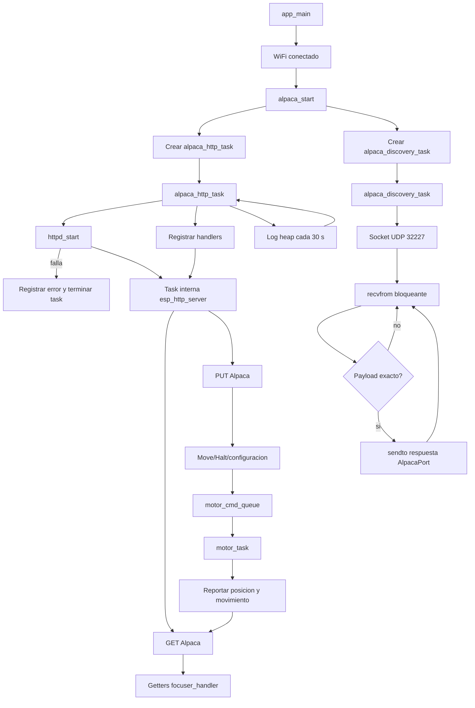

# alpaca.c - Servidor HTTP ASCOM Alpaca

## Propósito

Implementa el servidor HTTP del protocolo ASCOM Alpaca para exponer el focuser por red. El modulo usa `esp_http_server`, crea una task de configuracion/vida del servidor y una task independiente para discovery UDP. Los handlers HTTP son ejecutados por la task interna de `esp_http_server` y conectan las operaciones Alpaca con `focuser_handler`.

## Estado Actual

El componente está integrado en `main.c` y se inicia después de una conexión WiFi exitosa:

```c
wifi_init_sta() -> ws_server_start() -> alpaca_start()
```

El servidor escucha en el puerto configurado por `ALPACA_HTTP_PORT` (actualmente `11111`). Usa un segundo `ctrl_port` interno de HTTPD para coexistir con el servidor WebSocket del puerto 80.

El discovery Alpaca IPv4 escucha en UDP `32227`, el puerto estandar conocido por los clientes. Solo responde al payload ASCII exacto `alpacadiscovery1`, con un JSON minimo como `{"AlpacaPort":11111}` enviado unicast al origen del datagrama. El discovery IPv6/multicast IPv6 no esta implementado.

**Estado de implementación:** funcional en el alcance actualmente codificado, pero todavía no es una implementación completa del contrato ASCOM Alpaca Focuser ni está validada con un cliente Alpaca externo. Las rutas existentes permiten consultar el estado y ejecutar `Move`/`Halt`; quedan endpoints estándar por completar.

## Endpoints Implementados

### Management

| Método | Ruta | Función |
|---|---|---|
| GET | `/management/apiversions` | Versiones de API disponibles |
| GET | `/management/v1/description` | Nombre, fabricante, versión y ubicación |
| GET | `/management/v1/configureddevices` | Dispositivos Alpaca expuestos por el servidor |

### Focuser

Base: `/api/v1/focuser/0`

| Método | Ruta | Fuente o acción |
|---|---|---|
| GET | `/connected` | Estado de conexión lógica |
| GET | `/position` | Posición absoluta en micropasos |
| GET | `/ismoving` | Estado de movimiento |
| GET | `/absolute` | Indica soporte de posición absoluta |
| GET | `/maxstep` | Límite máximo de posición |
| GET | `/maxincrement` | Incremento máximo permitido |
| GET | `/stepsize` | Tamaño de micropaso en micrómetros |
| GET | `/tempcompavailable` | Disponibilidad de compensación térmica |
| GET | `/tempcomp` | Estado de compensación térmica |
| GET | `/temperature` | Temperatura actual |
| PUT | `/move` | Solicita movimiento absoluto |
| PUT | `/halt` | Solicita parada controlada |

Las respuestas de Management y de los endpoints del dispositivo incluyen la envoltura
estándar con `ClientTransactionID`, `ServerTransactionID`, `ErrorNumber` y
`ErrorMessage`. `configureddevices` anuncia el focuser como `DeviceType: "Focuser"`,
`DeviceNumber: 0` y un `UniqueID` estable.

Los GET consultan el estado mediante funciones públicas de `focuser_handler`. El PUT `/move` llama a `focuser_handler_move_to()`, que valida el rango, calcula el delta y encola un `motor_cmd_t` relativo. El PUT `/halt` usa el flag atómico de parada, fuera de la cola normal.

## Formato de Respuesta

Las operaciones `/api/v1/...` usan la envoltura Alpaca:

```json
{
  "ClientTransactionID": 1,
  "ServerTransactionID": 1,
  "ErrorNumber": 0,
  "ErrorMessage": "",
  "Value": 12345
}
```

Las operaciones PUT responden sin el campo `Value`, conforme al formato de operaciones de escritura. Los parámetros PUT llegan como `application/x-www-form-urlencoded`, por ejemplo:

```text
Position=12345&ClientTransactionID=5
```

No se usa JSON para leer los parámetros de `/move` o `/halt`.

## Arquitectura Interna

- `alpaca_start()` copia los textos de configuración a buffers internos.
- Crea `alpaca_http_task` y `alpaca_discovery_task` con el puerto, prioridad, core y stack recibidos.
- La task HTTP arranca HTTPD, registra los URI handlers y permanece viva para registrar heap periódicamente.
- `httpd_start()` crea además la task interna del componente `esp_http_server`; esa es la task que ejecuta los handlers de GET y PUT.
- La task de discovery permanece bloqueada en `recvfrom()` y descarta cualquier payload distinto de `alpacadiscovery1`.
- `alpaca.c` incluye `focuser_handler.h`; `alpaca.h` mantiene una interfaz independiente y solo expone `alpaca_config_t`.
- El dispositivo es fijo: `focuser/0`, porque el firmware controla un único focuser.

## Entradas y salidas

### Entradas de arranque

- `alpaca_start(&alpaca_config_t)` se llama desde `app_main()` solo despues de que WiFi se conecte.
- `port`: puerto TCP del servidor Alpaca, actualmente `11111`.
- `task_priority`, `task_core_id` y `task_stack_words`: parametros usados por las dos tasks creadas por el modulo.
- Metadata del servidor y del dispositivo: se copia a buffers estaticos internos.

### Entradas durante la operacion

- Peticiones TCP HTTP en `/management/...` y `/api/v1/focuser/0/...`.
- Datagramas UDP en el puerto `32227` para discovery.
- Estado compartido de `focuser_handler`: posicion, movimiento, temperatura y compensacion termica.

### Salidas

- Respuestas HTTP JSON con `Value`, IDs de transaccion y estado de error.
- Comandos relativos `motor_cmd_t` en `motor_cmd_queue` mediante `focuser_handler_move_to()`.
- Solicitud de parada mediante el flag atomico de halt de `focuser_handler`.
- Respuesta UDP `{"AlpacaPort":11111}` al origen de un discovery valido.

## Flujo de arranque de `alpaca_start()`

1. Comprueba que `cfg` no sea `NULL`.
2. Comprueba que no exista otro servidor Alpaca en `alpaca_httpd`.
3. Copia la metadata de servidor y dispositivo a los buffers internos.
4. Reserva y almacena el puerto TCP para pasarlo a `alpaca_http_task`.
5. Crea `alpaca_http_task` con `xTaskCreatePinnedToCore()`.
  - Si falla, libera el argumento y devuelve `ESP_FAIL`.
6. Reserva y almacena el puerto TCP para `alpaca_discovery_task`.
  - Si falla la reserva, devuelve `ESP_OK`: el servidor HTTP continuara, pero sin discovery.
7. Crea `alpaca_discovery_task`.
  - Si falla, libera el argumento, registra el error y el servidor HTTP continua.
8. Devuelve `ESP_OK`.

El retorno `ESP_OK` despues de crear la task HTTP significa que la task fue creada, no que `httpd_start()` ya haya terminado correctamente. La inicializacion real de HTTPD ocurre de forma asincrona dentro de `alpaca_http_task`.

## Flujo de `alpaca_http_task`

1. Lee el puerto recibido y libera el argumento dinamico.
2. Registra el heap libre antes de iniciar HTTPD.
3. Construye `httpd_config_t` con:
  - `server_port = port`.
  - `max_uri_handlers = 32`.
  - `ctrl_port = ESP_HTTPD_DEF_CTRL_PORT + 1`, para no colisionar con el WebSocket.
4. Ejecuta `httpd_start(&alpaca_httpd, &config)`.
  - Si falla, registra el error, elimina esta task y no registra rutas.
  - Si funciona, `esp_http_server` crea su task interna para atender sockets y ejecutar handlers.
5. Registra las tres rutas de Management.
6. Registra las rutas del focuser:
  - GET de estado y metadata.
  - PUT de `move`, `halt`, `connected` y `tempcomp`.
  - PUT de comandos deprecados, que responden `NotImplemented` en vez de 404.
7. Registra el heap consumido y el stack libre minimo.
8. Entra en un ciclo infinito:
  - Espera 30 segundos.
  - Registra el heap libre actual.
  - Repite.

Esta task no procesa directamente peticiones HTTP. Su ciclo posterior al registro sirve para mantener vivo el contexto de configuracion y obtener observabilidad del heap; la atencion HTTP ocurre en la task interna de HTTPD.

## Flujo de `alpaca_discovery_task`

1. Lee el puerto TCP Alpaca recibido y libera el argumento dinamico.
2. Crea un socket UDP IPv4.
  - Si falla, registra el error y termina la task.
3. Hace `bind()` al puerto fijo `32227` en `INADDR_ANY`.
  - Si falla, cierra el socket, registra el error y termina la task.
4. Reserva buffers locales para el mensaje recibido y la respuesta.
5. Entra en un ciclo bloqueante:
  - Espera un datagrama con `recvfrom()`.
  - Si hay error de recepcion, registra el error y vuelve a esperar.
  - Comprueba que longitud y contenido sean exactamente `alpacadiscovery1`.
  - Si no coinciden, descarta el datagrama y vuelve a esperar.
  - Construye `{"AlpacaPort":<puerto TCP>}`.
  - Envia la respuesta con `sendto()` al origen del datagrama.
6. Repite indefinidamente mientras el socket siga abierto.

El discovery no usa la task interna de HTTPD: es un protocolo UDP independiente.

## Flujo de una peticion HTTP

Los handlers se ejecutan secuencialmente dentro de la task interna de `esp_http_server` por cada peticion atendida.

### GET

1. Lee `ClientTransactionID` desde la query string; si falta o es demasiado larga, usa `0`.
2. Consulta metadata o estado mediante `focuser_handler` cuando corresponde.
3. Obtiene el siguiente `ServerTransactionID`.
4. Construye la respuesta JSON Alpaca.
5. Envia la respuesta HTTP con `Content-Type: application/json`.
6. Libera el JSON y retorna el resultado de `httpd_resp_send()`.

### PUT `/move`

1. Lee el body `application/x-www-form-urlencoded`.
2. Rechaza un body mayor que 128 bytes o mal formado.
3. Extrae `Position` y `ClientTransactionID`.
4. Llama a `focuser_handler_move_to()`.
5. `focuser_handler` valida limites, calcula el delta relativo y envia un `motor_cmd_t` a `motor_cmd_queue`.
6. Devuelve una respuesta sin `Value`, con error cero o con el codigo de error correspondiente.

La task HTTP no mueve el motor ni espera a que termine el movimiento. `motor_task` consume la queue, ejecuta el TMC2209 y reporta el resultado al `focuser_handler`.

### PUT `/halt`

1. Lee el body y los IDs de transaccion.
2. Activa el flag atomico de halt en `focuser_handler`.
3. Devuelve la respuesta Alpaca.
4. `motor_task` observa el flag durante la ejecucion y detiene el movimiento segun su flujo de control.

### Otros PUT

- `/connected`: cambia la bandera logica `alpaca_connected`; no corta WiFi ni desconecta el focuser fisico.
- `/tempcomp`: cambia el estado de compensacion termica del focuser.
- `/action`, `/commandblind`, `/commandbool` y `/commandstring`: siempre responden `NotImplemented`.

## Relaciones con otras tasks



## Pseudoflujo para el diagrama

```text
app_main
  -> WiFi conectado?
  -> no: no crear Alpaca
  -> si: alpaca_start(config)
    -> copiar metadata
    -> crear alpaca_http_task
    -> crear alpaca_discovery_task

alpaca_http_task
  -> iniciar HTTPD
  -> [HTTPD inicio?] no: log + terminar
  -> registrar Management y Focuser
  -> repetir: esperar 30 s + loguear heap

task interna esp_http_server
  -> recibir peticion HTTP
  -> [GET?] consultar estado y responder JSON
  -> [PUT move?] parsear body -> validar -> encolar movimiento
  -> [PUT halt?] activar halt atomico
  -> responder transaction IDs y error

alpaca_discovery_task
  -> crear y enlazar UDP 32227
  -> [socket/bind fallo?] terminar
  -> esperar datagrama
  -> [mensaje == alpacadiscovery1?]
     no: descartar y esperar
     si: responder AlpacaPort y esperar
```

## Límites y Validaciones

- Un único servidor Alpaca por firmware.
- Un único dispositivo Alpaca (`focuser/0`).
- Body PUT máximo: 128 bytes; un body mayor se rechaza, no se trunca.
- Los valores inválidos se responden con códigos Alpaca estándar o del rango de driver (`0x500`).
- Si el servidor ya está arrancado, `alpaca_start()` devuelve `ESP_ERR_INVALID_STATE`.
- Si no hay memoria para el argumento del puerto, devuelve `ESP_ERR_NO_MEM`.

## Integración con el Estado del Focuser

```text
Cliente Alpaca
    |
    +-- GET position/temperature/ismoving --> focuser_handler getters
    |
    +-- PUT move --------------------------> focuser_handler_move_to()
    |                                           |
    |                                           +--> motor_cmd_queue
    |
    +-- PUT halt --------------------------> atomic halt flag
                                                |
                                                +--> tmc2209_move_steps()
```

El servidor no controla GPIO, UART o I2C directamente. El movimiento físico sigue siendo responsabilidad exclusiva de `motor_task` y `tmc2209`.

## Compatibilidad y Estabilidad

La implementación puede considerarse **operativa para el subconjunto implementado**, no todavía “estable/completa” en sentido de conformidad Alpaca. Antes de declararla estable deben probarse:

1. `/management/apiversions` y `/management/v1/description`.
2. Todos los GET registrados.
3. `PUT /move` con posiciones válidas, fuera de rango y queue llena.
4. `PUT /halt` durante un movimiento real.
5. Respuestas de transaction IDs y códigos de error con un cliente ASCOM Alpaca real.
6. Interacción simultánea de Alpaca y WebSocket.

## Relación con WebSocket

Alpaca y WebSocket son servidores HTTP independientes:

- Alpaca: puerto 11111, API estándar de control de focuser.
- WebSocket: puerto 80, comandos JSON relativos, ACK y telemetría.

Ambos pueden coexistir porque `main.c` inicia los dos con `ctrl_port` distintos. No deben confundirse sus contratos: Alpaca trabaja con posición absoluta y WebSocket conserva el canal relativo/bajo nivel.

## Dependencias

- `esp_http_server`
- FreeRTOS
- `focuser_handler`
- cJSON
- ESP-IDF logging/system APIs

## Código Legacy Relacionado

Este componente reemplaza la necesidad de usar interfaces locales o clientes específicos para controlar el focuser por red. Sin embargo, WebSocket no es legacy: sigue siendo una interfaz activa de telemetría y comandos relativos. La interfaz USB de texto y los presets automáticos están documentados como legacy en `ARCHITECTURE.md` porque no son necesarios para operar mediante Alpaca o WebSocket.
