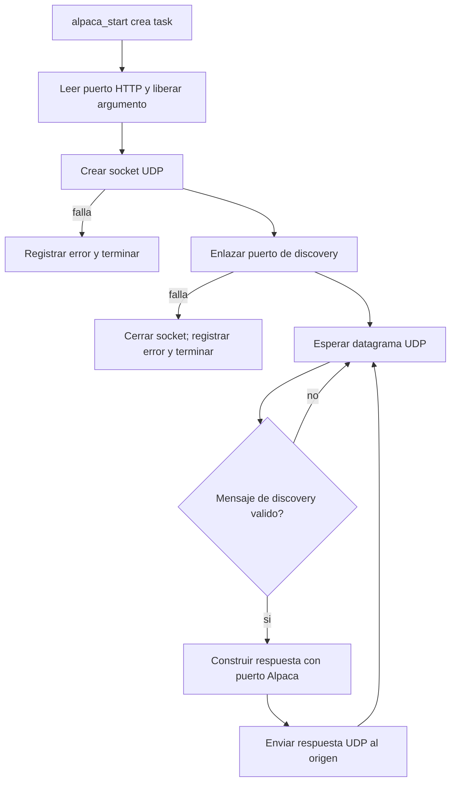

# `alpaca_discovery_task`

## Proposito

Permitir que clientes Alpaca descubran el puerto TCP del servidor HTTP mediante el protocolo de descubrimiento UDP. La task es creada por `alpaca_start()` cuando se inicia la funcionalidad Alpaca.

## Distribucion

- **Core:** 0.
- **Prioridad:** `ALPACA_TASK_PRIORITY`.
- **Stack:** `ALPACA_TASK_STACK_WORDS`.
- **Puerto UDP de escucha:** `ALPACA_DISCOVERY_PORT`.
- **Puerto anunciado:** el puerto HTTP recibido desde `alpaca_start()`.

## Flujo

1. Lee el puerto HTTP Alpaca recibido como argumento y libera la memoria.
2. Crea un socket UDP.
3. Si falla la creacion, registra el error y termina.
4. Enlaza el socket al puerto de descubrimiento UDP.
5. Si el `bind()` falla, cierra el socket, registra el error y termina.
6. Espera datagramas UDP con `recvfrom()`.
7. Descarta mensajes con longitud o contenido distinto al mensaje de descubrimiento esperado.
8. Para una solicitud valida, construye `{"AlpacaPort":<puerto_http>}`.
9. Responde al origen mediante `sendto()`.
10. Vuelve a esperar otra solicitud.

## Relacion con el servidor HTTP

Esta task no atiende endpoints HTTP ni controla el motor. Su unica funcion es anunciar el puerto donde `alpaca_http_task` escucha las solicitudes Alpaca.

## Ubicacion

- Creacion: `components/alpaca/alpaca.c`, funcion `alpaca_start()`.
- Implementacion: `components/alpaca/alpaca.c`, funcion `alpaca_discovery_task()`.
