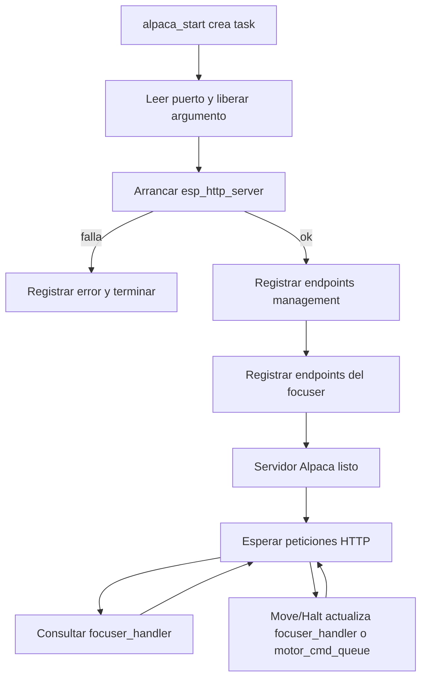

# `alpaca_http_task`

## Proposito

Mantener el servidor HTTP Alpaca y registrar sus endpoints de management, focuser y Common Device Interface. La task es creada indirectamente por `alpaca_start()` cuando WiFi esta disponible.

## Distribucion

- **Core:** 0.
- **Prioridad:** `ALPACA_TASK_PRIORITY`.
- **Stack:** `ALPACA_TASK_STACK_WORDS`.
- **Puerto:** `ALPACA_HTTP_PORT`.

## Flujo

1. Lee el puerto recibido como argumento y libera la memoria del argumento.
2. Guarda una medicion inicial del heap.
3. Configura y arranca `esp_http_server`.
4. Si `httpd_start()` falla, registra el error, elimina la task y termina.
5. Registra los endpoints de management:
   - `/management/apiversions`
   - `/management/v1/description`
   - `/management/v1/configureddevices`
6. Construye y registra los endpoints del focuser:
   - Lecturas de conexion, posicion, movimiento, limites, temperatura y compensacion.
   - Comandos `move`, `halt`, `connected` y `tempcomp`.
   - Metadata del dispositivo y acciones soportadas.
   - Endpoints deprecados que responden como no implementados.
7. Registra el heap usado y el puerto activo.
8. Permanece viva, esperando peticiones HTTP mientras registra periodicamente el heap disponible.

## Relacion con el resto del sistema

Los handlers Alpaca consultan y actualizan `focuser_handler`. Las solicitudes de movimiento se transforman en comandos para `motor_cmd_queue`; esta task no controla directamente GPIO, UART ni el TMC2209.

## Ubicacion

- Creacion: `components/alpaca/alpaca.c`, funcion `alpaca_start()`.
- Implementacion: `components/alpaca/alpaca.c`, funcion `alpaca_http_task()`.
