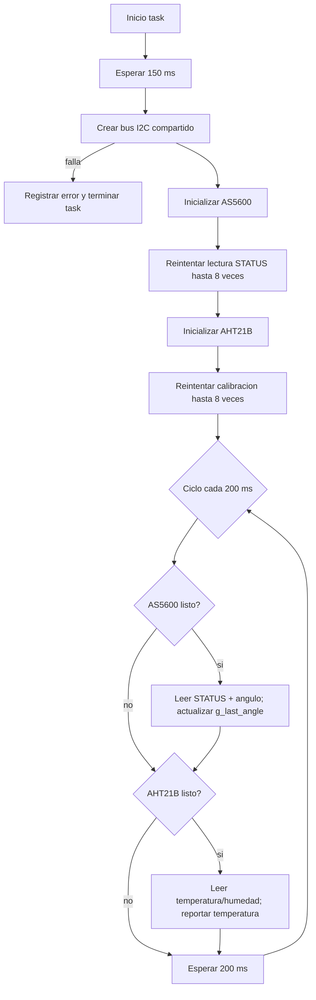

# `i2c_sensors_task`

## Proposito

Crear y administrar el bus I2C de los sensores, inicializar AS5600 y AHT21B, y leerlos periodicamente desde una unica task en el Core 0. Un fallo de un sensor no debe detener al otro ni tumbar la task.

## Entradas y salidas

- **Bus:** I2C `I2C_NUM_0`, SDA GPIO8, SCL GPIO9.
- **Dispositivos:** AS5600 a 400 kHz y AHT21B a 100 kHz.
- **Estado local:** `encoder.ready`, `climate.ready`.
- **Estado global:** `g_last_angle` y temperatura en `focuser_handler`.
- **Periodo normal:** 200 ms.

## Flujo de inicializacion

1. Espera 150 ms para estabilizar alimentacion y lineas I2C.
2. Crea el bus con `i2c_new_master_bus()`.
3. Si el bus falla, registra el error, elimina la task y termina.
4. Construye la configuracion del AS5600 usando el bus compartido.
5. Ejecuta `as5600_init()`.
6. Si el init funciona, llama a `i2c_retry_detect()` usando una lectura real de STATUS.
   - Hace hasta 8 intentos.
   - Espera 100 ms entre intentos.
   - Si tiene exito, marca `encoder.ready = true`.
   - Si falla, registra el error y continua; el sensor puede recuperarse luego.
7. Construye la configuracion del AHT21B sobre el mismo bus.
8. Ejecuta `aht21b_init()`.
9. Si el init funciona, llama a `i2c_retry_detect()` usando `aht21b_ensure_calibrated()`.
   - Hace hasta 8 intentos.
   - Espera 100 ms entre intentos.
   - Si tiene exito, marca `climate.ready = true`.
   - Si falla, registra el error y continua.
10. Registra el stack libre y entra al ciclo periodico.

## Flujo periodico

1. Si `encoder.ready` es verdadero:
   - Lee STATUS mediante `as5600_read_status()`.
   - Lee el angulo mediante `as5600_read_raw_angle()`.
   - Actualiza `g_last_angle`.
   - Registra angulo y deteccion del iman si ambas lecturas funcionan.
   - Registra error si falla STATUS o angulo.
2. Si `climate.ready` es verdadero:
   - Ejecuta `aht21b_read()` para temperatura y humedad.
   - Si funciona, registra los valores y actualiza `focuser_handler_set_temperature()`.
   - Si falla, registra el error y conserva viva la task.
3. Espera 200 ms.
4. Repite.

## Casos de error

- **Fallo al crear el bus:** termina la task; ninguno de los dos sensores puede operar.
- **Fallo de init o deteccion del AS5600:** solo se omiten sus lecturas; AHT21B sigue su flujo.
- **Fallo de init o calibracion del AHT21B:** solo se omiten sus lecturas; AS5600 sigue su flujo.
- **Fallo durante una lectura:** se registra el error y se vuelve a intentar en el siguiente ciclo.
- **Bus compartido:** las transacciones son secuenciales dentro de esta misma task, por lo que no hay carrera entre sensores.

## Relaciones con otras tareas



## Pseudoflujo para el diagrama

```text
Inicio
  -> Esperar estabilizacion
  -> Crear bus I2C
  -> [bus creado?] no: terminar
  -> Init AS5600 y reintentar deteccion
  -> Init AHT21B y reintentar calibracion
  -> Leer AS5600 si esta ready
  -> Leer AHT21B si esta ready
  -> Esperar 200 ms
  -> Repetir
```

## Ubicacion

- Implementacion y orquestacion: `main/main.c`, funcion `i2c_sensors_task()`.
- Reintentos: `i2c_retry_detect()` en `main/main.c`.
- Drivers: `components/as5600/as5600.c` y `components/aht21b/aht21b.c`.
- Estado publicado: `components/focuser_handler/focuser_handler.c`.
