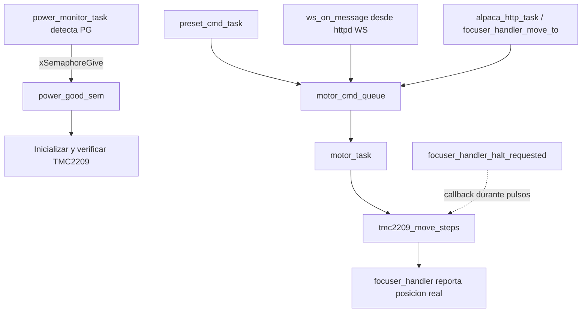

# `motor_task`

## Proposito

Controlar exclusivamente el TMC2209 y convertir los comandos de `motor_cmd_queue` en pulsos STEP/DIR. La task esta fijada al Core 1, con prioridad 10, y permanece viva durante toda la operacion del motor.

## Entradas y salidas

- **Entrada de arranque:** `power_good_sem`.
- **Entrada de comandos:** `motor_cmd_queue`, con elementos `motor_cmd_t` (`steps`, `dir`).
- **Driver usado:** `tmc2209.c` mediante el objeto global `motor`.
- **Estado reportado:** `focuser_handler_set_moving()`, `focuser_handler_report_move_done()` y `focuser_handler_halt_consume()`.
- **Indicador:** GPIO `PIN_MOTOR_STATUS_LED`.
- **Salida fisica:** pulsos del TMC2209 mediante `tmc2209_move_steps()`.

## Flujo de inicializacion

1. La task espera `power_good_sem` con un timeout de 2 segundos.
2. Si no hay Power Good, registra una advertencia y vuelve a esperar. No inicializa UART ni GPIO del TMC2209.
3. Cuando recibe el semaforo, construye `tmc2209_config_t`, incluyendo el callback `focuser_handler_halt_requested`.
4. Ejecuta `tmc2209_init()`.
   - Si no se puede instalar el UART, `ESP_ERROR_CHECK()` aborta el firmware.
5. Espera 200 ms para el Power-On Reset del driver.
6. Intenta leer `IFCNT` hasta cinco veces por intento principal.
7. Si no obtiene respuesta, espera 1 segundo y repite indefinidamente.
8. Si obtiene respuesta, consulta el estado, configura el TMC2209 y verifica `CHOPCONF`/la resolucion configurada.
9. Si la verificacion falla, espera 1 segundo y repite desde la comprobacion de comunicacion.
10. Cuando todo es valido, habilita el driver, espera 50 ms, consulta el estado final y registra el stack libre.

## Flujo de operacion por comando

1. Espera indefinidamente en `xQueueReceive(motor_cmd_queue, ...)`.
2. Marca el focuser como moviendose.
3. Enciende el LED de estado del motor.
4. Ejecuta `tmc2209_move_steps(&motor, cmd.steps, cmd.dir)`.
   - `dir = 0`: desplazamiento positivo, abre el focuser.
   - `dir = 1`: desplazamiento negativo, cierra el focuser.
   - El callback de halt puede detener el movimiento antes de completar todos los micropasos.
5. Apaga el LED.
6. Reporta el desplazamiento realmente ejecutado, con signo, a `focuser_handler`.
7. Marca el focuser como no moviendose.
8. Consume siempre el flag de halt para que no afecte al siguiente comando.
9. Espera 50 ms, consulta el estado del TMC2209 e imprime el resultado.
10. Regresa a esperar otro comando.

## Casos de error y bloqueos

- **PG nunca confirmado:** la task no energiza ni inicializa el driver; solo registra una advertencia cada 2 s.
- **CH224K no inicializado:** `power_monitor_task` no libera el semaforo, por lo que se conserva el comportamiento anterior.
- **UART no instalable:** `tmc2209_init()` usa `ESP_ERROR_CHECK()`, por lo que el firmware se detiene.
- **Driver temporalmente no disponible:** se reintenta indefinidamente con espera de 1 s.
- **Movimiento detenido:** se reporta la cantidad real ejecutada, no la cantidad solicitada.
- **Cola vacia:** la task queda bloqueada sin consumir CPU.

## Relaciones con otras tareas



## Pseudoflujo para el diagrama

```text
Inicio task
  -> Esperar PG
  -> [PG confirmado?] no: log + esperar 2 s
  -> si
  -> Inicializar TMC2209
  -> [UART valido?] no: abortar por ESP_ERROR_CHECK
  -> Verificar comunicacion/configuracion
  -> [driver listo?] no: esperar 1 s y reintentar
  -> Habilitar driver
  -> Esperar comando de cola
  -> Recibir comando
  -> Marcar moving + LED ON
  -> Ejecutar pasos
  -> LED OFF
  -> Reportar pasos reales + marcar no moving
  -> Consumir halt + comprobar estado
  -> Volver a esperar comando
```

## Ubicacion

- Implementacion: `main/main.c`, funcion `motor_task()`.
- Driver externo: `components/tmc2209/tmc2209.c`.
- Estado del focuser: `components/focuser_handler/focuser_handler.c`.
