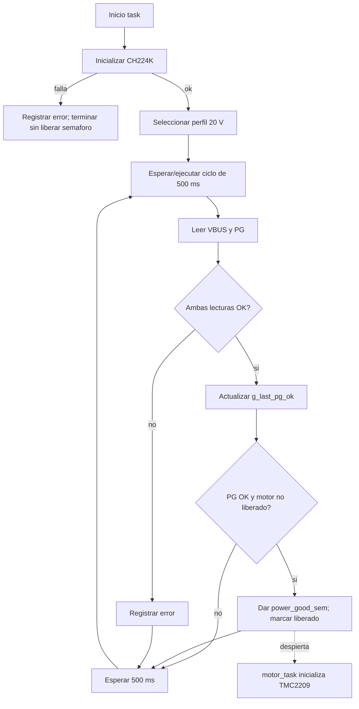

# `power_monitor_task`

## Proposito

Inicializar el controlador CH224K, seleccionar el perfil de alimentacion, leer VBUS y Power Good, y liberar una sola vez a `motor_task` cuando la alimentacion esta confirmada.

## Entradas y salidas

- **Hardware:** pines CFG1/CFG2/CFG3, PG y ADC de VSENSE.
- **Driver:** `ch224k.c` mediante `power_pd`.
- **Sincronizacion:** `power_good_sem`.
- **Estado global:** `g_last_pg_ok`.
- **Periodo:** 500 ms.
- **Prioridad/core:** prioridad 1, Core 0.

## Flujo de inicializacion

1. Construye `ch224k_config_t` con pines y parametros del divisor ADC.
2. Ejecuta `ch224k_init()`.
3. Si falla:
   - Registra el error.
   - No entrega `power_good_sem`.
   - Elimina la task y termina.
   - `motor_task` permanece bloqueada y no toca el TMC2209.
4. Si funciona, solicita el perfil de 20 V mediante `ch224k_set_voltage()`.
5. Registra el stack libre.
6. Inicializa `motor_released = false`.

## Flujo periodico

1. Lee el voltaje de bus con `ch224k_read_voltage()`.
2. Lee Power Good con `ch224k_read_power_good()`.
3. Si ambas lecturas funcionan:
   - Registra VBUS y estado PG.
   - Actualiza `g_last_pg_ok`.
   - Si `pg_ok` es verdadero y `motor_released` es falso, entrega `power_good_sem` y marca `motor_released = true`.
4. Si alguna lectura falla, registra el error y no libera el motor por esa iteracion.
5. Espera 500 ms.
6. Repite.

## Regla de liberacion

El semaforo es de arranque, no de vigilancia continua. Solo se entrega la primera vez que se observa `pg_ok == true`. Si PG cae despues, esta task actualiza `g_last_pg_ok`, pero no vuelve a bloquear `motor_task`; para eso haria falta un `EventGroup` u otro mecanismo de supervision continua.

## Relaciones con otras tareas



## Pseudoflujo para el diagrama

```text
Inicio
  -> Init CH224K
  -> [init correcto?] no: terminar sin semaforo
  -> Seleccionar 20 V
  -> Leer VBUS + PG
  -> [lecturas correctas?] no: log + esperar
  -> Actualizar estado
  -> [PG OK y aun no liberado?] si: dar semaforo una vez
  -> Esperar 500 ms
  -> Repetir
```

## Ubicacion

- Implementacion: `main/main.c`, funcion `power_monitor_task()`.
- Driver: `components/ch224k/ch224k.c`.
- Consumidor del semaforo: `motor_task()` en `main/main.c`.
