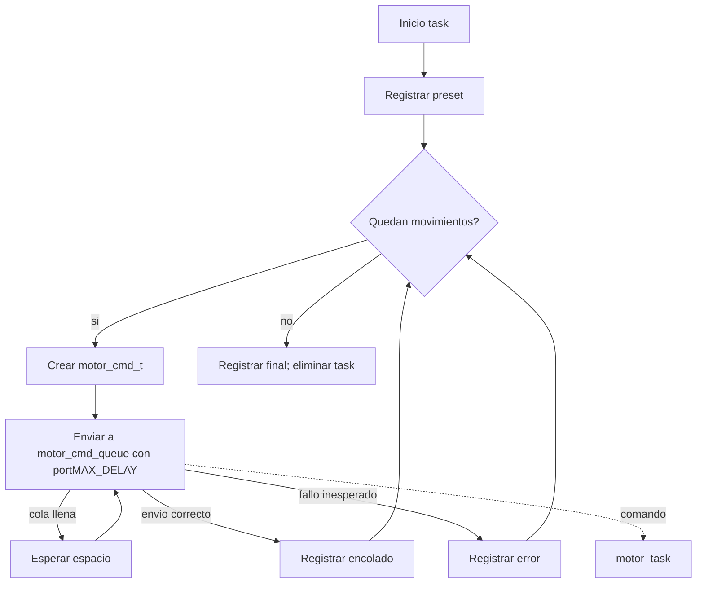

# `preset_cmd_task`

## Proposito

Generar un movimiento interno de prueba cuando el USB-C esta ocupado como fuente de Power Delivery y no se usa como consola. Es un productor temporal de `motor_cmd_queue`.

## Configuracion actual

- Cantidad: `PRESET_MOVE_COUNT` movimientos.
- Cada movimiento: `PRESET_STEPS_PER_MOVE` micropasos.
- Direccion: `PRESET_DIR`.
- Core: 0.
- Prioridad: 4.
- Stack: 2048 words.

## Flujo

1. La task inicia y registra la configuracion del preset.
2. Entra a un `for` desde `0` hasta `PRESET_MOVE_COUNT - 1`.
3. Crea un `motor_cmd_t` con los pasos y direccion preconfigurados.
4. Envia el comando a `motor_cmd_queue` con `portMAX_DELAY`.
   - Si la cola esta llena, espera hasta que `motor_task` retire un comando.
   - No descarta movimientos.
5. Si el envio falla inesperadamente, registra el movimiento fallido y continua con el siguiente.
6. Registra que todos los movimientos fueron encolados.
7. Se elimina con `vTaskDelete(NULL)` y no vuelve a ejecutarse.

## Importante para el flujo global

La task no mueve el motor directamente, no accede al TMC2209 y no espera a PG. Solo deja comandos en la cola. `motor_task` puede recibirlos despues de completar su propia espera por `power_good_sem` y su inicializacion del driver.

## Relaciones con otras tareas



## Pseudoflujo para el diagrama

```text
Inicio
  -> Registrar preset
  -> [quedan movimientos?] no: eliminar task
  -> Crear comando fijo
  -> Enviar a cola
  -> [cola llena?] si: esperar y reintentar envio
  -> Registrar resultado
  -> Siguiente movimiento
  -> Repetir
```

## Ubicacion

- Implementacion: `main/main.c`, funcion `preset_cmd_task()`.
- Contrato de cola: `components/focuser_handler/include/motor_cmd.h`.
- Consumidor: `motor_task()` en `main/main.c`.
