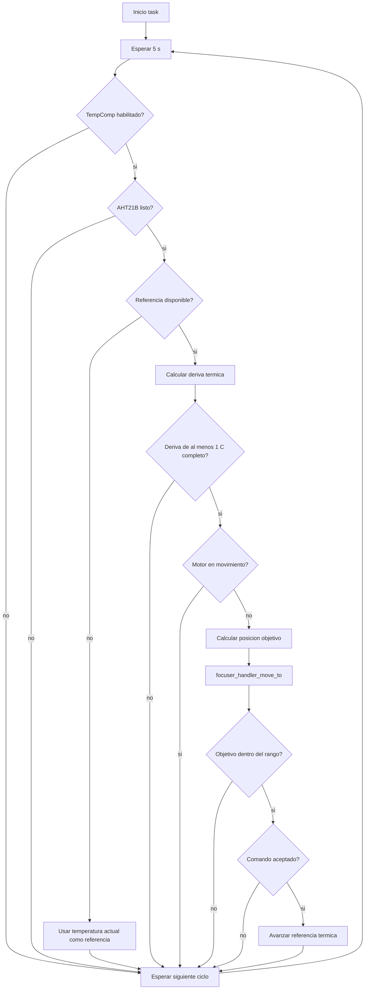

# `thermal_comp_task`

## Proposito

Aplicar compensacion termica automatica al focuser cuando `TempComp` esta habilitado y la temperatura cambia al menos 1 grado C completo respecto a una referencia interna.

## Distribucion y configuracion

- **Core:** 0.
- **Prioridad:** 2.
- **Stack:** 3072 words.
- **Periodo de evaluacion:** `THERMAL_COMP_POLL_PERIOD_MS` = 5000 ms.
- **Correccion configurada:** `THERMAL_COMP_STEPS_PER_DEGREE_C` = 0 micropasos por grado C actualmente; queda pendiente de calibracion.
- **Estado consultado:** `focuser_handler` (`tempcomp`, temperatura, movimiento y posicion).
- **Salida:** `focuser_handler_move_to()`, que valida el rango y encola en `motor_cmd_queue`.

## Flujo de inicializacion

1. La task registra el core donde se ejecuto y el stack libre.
2. Inicializa una referencia termica local sin valor (`have_reference = false`).
3. Entra en el ciclo de evaluacion cada 5 segundos.

## Flujo periodico

1. Espera el periodo configurado.
2. Lee si `TempComp` esta habilitado.
3. Si la compensacion acaba de activarse:
   - Si AHT21B esta listo, toma la temperatura actual como referencia.
   - Si AHT21B no esta listo, deja la referencia pendiente y espera ciclos posteriores.
4. Si TempComp esta deshabilitado o el AHT21B no esta listo, no actua en ese ciclo.
5. Si no existe referencia, toma la temperatura actual y continua.
6. Calcula la diferencia entre la temperatura actual y la referencia.
7. Trunca la diferencia hacia cero para considerar solo grados C completos.
8. Si la deriva es 0, conserva la fraccion pendiente y espera el siguiente ciclo.
9. Si el motor esta moviendose, pospone la compensacion sin modificar la referencia.
10. Si el motor esta quieto, calcula:
    - `target_position = current_position + delta_degrees * THERMAL_COMP_STEPS_PER_DEGREE_C`
11. Llama a `focuser_handler_move_to(target_position, 100 ms)`.
12. Si el comando se encola correctamente, avanza la referencia exactamente `delta_degrees` y deja que `motor_task` ejecute el movimiento.
13. Si el objetivo esta fuera del rango del focuser, no avanza la referencia y reintenta en otro ciclo.
14. Si la cola rechaza el comando por otro error, conserva la referencia y registra una advertencia.
15. Repite el ciclo.

## Interacciones

- `alpaca_focuser_tempcomp_put_handler()` cambia la bandera mediante `focuser_handler_set_tempcomp()`.
- `i2c_sensors_task` actualiza la temperatura en `focuser_handler`.
- `thermal_comp_task` solicita movimientos relativos a una posicion absoluta mediante `focuser_handler_move_to()`.
- `motor_task` consume el comando de `motor_cmd_queue` y reporta el desplazamiento real.
- No existe un arbitro central: si otro movimiento esta en curso, la compensacion espera sin cancelar ni reemplazarlo.

## Puntos importantes

- La task no genera pulsos ni accede directamente al TMC2209.
- La referencia no avanza al detectar una deriva; solo después de encolar con éxito la correccion.
- Si el motor esta ocupado, el delta termico queda pendiente para el siguiente ciclo.
- Con `THERMAL_COMP_STEPS_PER_DEGREE_C = 0`, la posicion objetivo no cambia; la calibracion de esta constante es necesaria para que la compensacion produzca movimiento.

## Ubicacion

- Creacion e implementacion: `main/main.c`, funcion `thermal_comp_task()`.
- Estado y encolado: `components/focuser_handler/focuser_handler.c`.
- Ejecucion fisica: `main/motor_task.md` y `components/tmc2209/tmc2209.c`.
