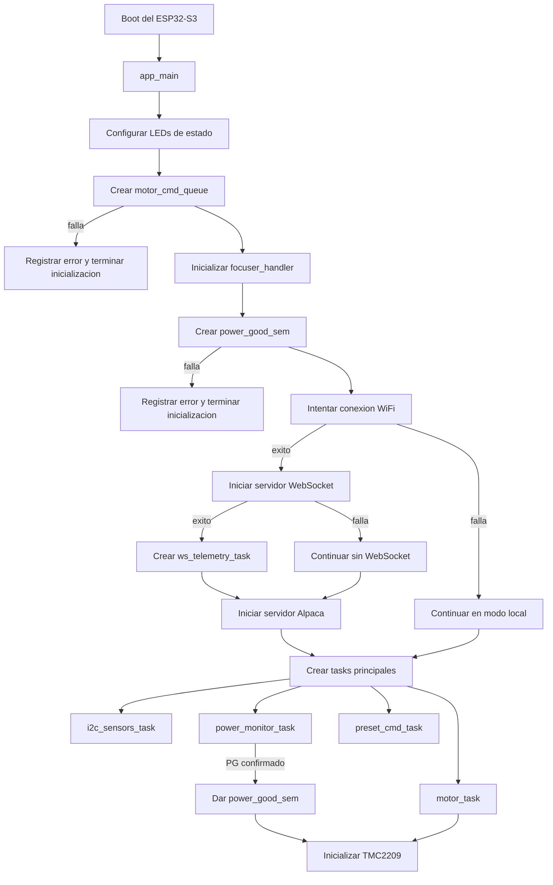
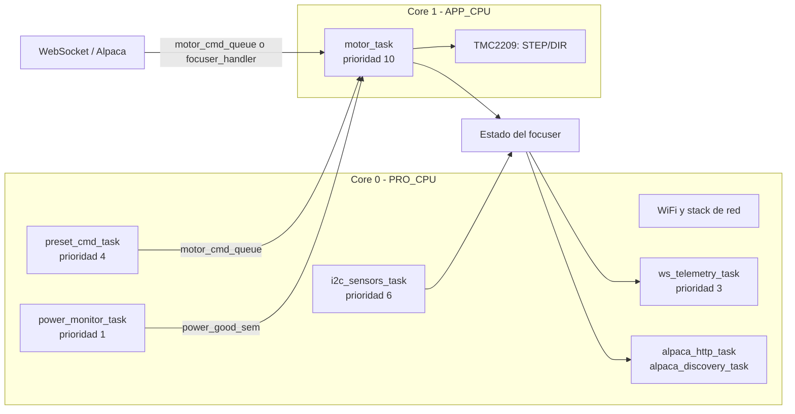
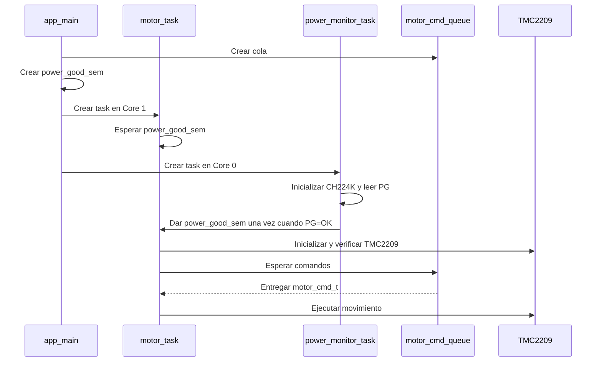

# Flujo General de Inicialización y Distribución

## Alcance

Este documento resume el arranque de `main.c` y la distribución del firmware en los dos cores del ESP32-S3. Los detalles internos de cada task están documentados por separado.

## Flujo de inicialización

`app_main()` prepara primero los recursos compartidos y después crea las tareas. La inicialización del hardware específico ocurre dentro de cada task, no directamente en `app_main()`.



## Secuencia de `app_main()`

1. Configura GPIO10 y GPIO12 como salidas y apaga ambos LEDs.
2. Crea `motor_cmd_queue`, que será el canal común para todos los comandos de movimiento.
3. Inicializa `focuser_handler` con la cola y los límites lógicos del focuser.
4. Crea `power_good_sem` vacío.
5. Ejecuta `wifi_init_sta()`.
   - La llamada bloquea hasta conectar o agotar los reintentos.
   - Si falla, el motor y los sensores continúan funcionando sin control remoto.
6. Si WiFi conecta:
   - Inicia el servidor WebSocket.
   - Si el WebSocket inicia correctamente, crea `ws_telemetry_task`.
   - Inicia el servidor Alpaca, que crea internamente sus tareas HTTP y discovery UDP.
7. Crea `motor_task` en el Core 1.
8. Crea `i2c_sensors_task` en el Core 0.
9. Crea `power_monitor_task` en el Core 0.
10. Crea `preset_cmd_task` en el Core 0.
11. `app_main()` termina; FreeRTOS continúa ejecutando las tasks de forma concurrente.

## Distribución por core



## Motivo de la distribución

- **Core 1:** queda dedicado a `motor_task`, que genera los pulsos STEP/DIR y requiere temporizacion estable.
- **Core 0:** concentra WiFi, servidores de red, sensores, monitor de alimentacion y comandos de prueba.
- El stack WiFi/BT y sus interrupciones permanecen en el Core 0; separar el motor reduce el jitter durante la generacion de micropasos.
- Las lecturas I2C son bloqueantes y se ejecutan en el Core 0, sin interferir directamente con el control del motor.

## Sincronización durante el arranque



## Contratos globales

| Recurso | Creador | Consumidor/productor | Funcion |
|---|---|---|---|
| `motor_cmd_queue` | `app_main` | Productores de comandos -> `motor_task` | Desacoplar la solicitud de movimiento de su ejecucion |
| `power_good_sem` | `app_main` | `power_monitor_task` -> `motor_task` | Impedir que el TMC2209 arranque sin alimentacion confirmada |
| Estado de `focuser_handler` | `app_main` | `motor_task` e `i2c_sensors_task` escriben; red consulta | Compartir posicion, movimiento y temperatura |

## Ramas de fallo del arranque

- **No se crea la cola o el semaforo:** `app_main()` registra el error y no crea las tasks.
- **WiFi falla:** se omiten WebSocket y Alpaca; el funcionamiento local continúa.
- **WebSocket falla:** no se crea la task de telemetria, pero Alpaca se intenta iniciar y el resto continúa.
- **Alpaca falla:** el motor, los sensores y el WebSocket no dependen de ese servidor.
- **CH224K falla:** `power_monitor_task` termina sin liberar el semaforo; `motor_task` permanece esperando y no energiza el TMC2209.
- **Sensor I2C falla:** su task continúa con ese sensor no disponible; no detiene el motor.

## Resumen para un diagrama unico

```text
Boot
  -> app_main configura LEDs
  -> crear cola de comandos
  -> inicializar estado del focuser
  -> crear semaforo PG
  -> conectar WiFi
       -> fallo: modo local
       -> exito: WebSocket + telemetria + Alpaca
  -> crear motor_task en Core 1
  -> crear tasks de sensores, potencia y preset en Core 0
  -> power_monitor_task confirma PG
  -> motor_task inicializa TMC2209
  -> productores colocan comandos en motor_cmd_queue
  -> motor_task ejecuta movimientos
  -> sensores y motor actualizan estado
  -> red consulta o transmite ese estado
```

## Referencias

- Orquestacion: `main/main.c`.
- Flujo de motor: `main/motor_task.md`.
- Flujo de sensores: `main/i2c_sensors_task.md`.
- Flujo de alimentacion: `main/power_monitor_task.md`.
- Flujo de telemetria: `main/ws_telemetry_task.md`.
