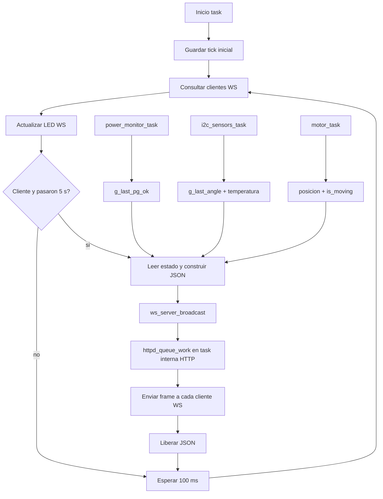

# `ws_telemetry_task`

## Proposito

Publicar periodicamente el estado del sistema a los clientes WebSocket conectados y controlar el LED de estado de WebSocket. La task se crea solo si WiFi y `ws_server_start()` fueron exitosos.

## Entradas y salidas

- **Consulta de clientes:** `ws_server_has_clients()`.
- **Estado de potencia:** `g_last_pg_ok`.
- **Estado de encoder:** `g_last_angle`.
- **Estado del focuser:** temperatura, posicion y `is_moving` desde `focuser_handler`.
- **Salida:** JSON enviado mediante `ws_server_broadcast()`.
- **Indicador:** GPIO `PIN_WS_STATUS_LED`.
- **Periodo de sondeo:** 100 ms.
- **Periodo de telemetria:** 5 s mientras haya clientes.

## Flujo de inicializacion

1. Guarda el tick actual en `last_telemetry`.
2. Entra en un ciclo infinito.

## Flujo periodico

1. Consulta si existe al menos un cliente WebSocket.
2. Enciende el LED si hay cliente y lo apaga si no hay ninguno.
3. Si hay cliente y han pasado al menos 5 segundos desde la ultima telemetria:
   - Actualiza `last_telemetry`.
   - Crea un objeto JSON.
   - Agrega `power_good`, `encoder_angle`, `climate_temperature`, `focuser_position` y `focuser_is_moving`.
   - Serializa con `cJSON_PrintUnformatted()`.
   - Envia el texto mediante `ws_server_broadcast()`.
   - Libera el texto y el objeto JSON.
4. Espera 100 ms.
5. Repite.

## Procesos que ocurren fuera de `main.c`

`ws_server_broadcast()` no escribe directamente desde esta task en los sockets. El componente WebSocket enumera clientes, crea trabajos asincronos y usa `httpd_queue_work()` para que la task interna de `esp_http_server` ejecute el envio. Esto evita llamar a las funciones de envio desde un contexto no seguro.

Los valores consumidos por la telemetria son producidos por otras rutas:

- `power_monitor_task` actualiza `g_last_pg_ok`.
- `i2c_sensors_task` actualiza `g_last_angle` y la temperatura de `focuser_handler`.
- `motor_task` actualiza posicion y estado de movimiento en `focuser_handler`.

## Relaciones con otras tareas

## Casos especiales

- **Sin servidor WS:** la task no se crea desde `app_main()`.
- **Sin clientes:** solo actualiza el LED y no genera JSON.
- **Cliente desconectado durante envio:** el componente WS registra el fallo puntual y continua con los demas clientes.
- **Fallo de memoria al crear JSON:** `cJSON_PrintUnformatted()` devuelve `NULL`; no se intenta transmitir y el ciclo continua.

## Ubicacion

- Implementacion: `main/main.c`, funcion `ws_telemetry_task()`.
- Servidor y envio asincrono: `components/ws_server/ws_server.c`.
- Callback de comandos entrantes: `ws_on_message()` en `main/main.c`.
